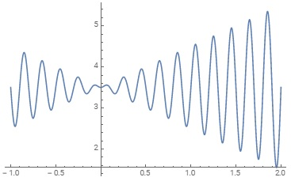

# GA

C 언어를 사용하여 유전알고리듬(GA:Genetic Algorithm)을 구현할 수 있는 
라이브러리를 제작하고자 한다.

범용 라이브러리를 목표로 한다.

[C++ GA library](http://lancet.mit.edu/ga/)

## 수학함수 최대값 찾기

f(x) = x * sin(10.*PI * x) + 3.5
-1.0 <= x <= 2.0

